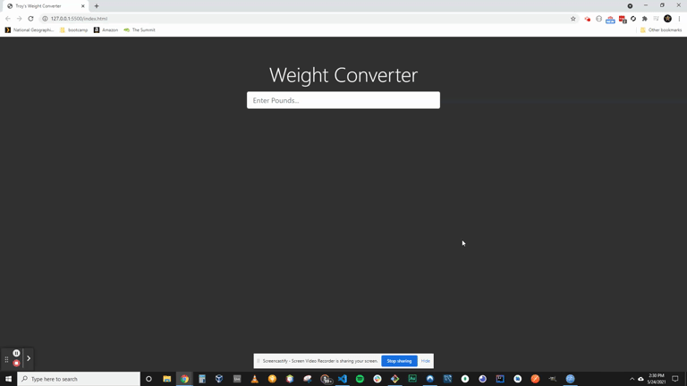

# Vanilla JS - Weight Conversion

### Pounds (lbs) to Kilograms/Grams/Ounces Converter

### Built With

* Vanilla JavaScript
* Bootstrap 4

### Background

For the past nine months I have been studying some of the more advanced frameworks and concepts related to JavaScript.  Now that my unemployment is running dry, and job prospects are non existant, I have had to focus my efforts on finding menial work to pay the bills.

So during this time, I figred it would be great to take a step back, and focus on the basics.

I know how important an active Github profile is, so it's important to keep those daily commits coming in every day.  

The plan is to retrace the learning progress I gained in my coding bootcamp, and follow that path again, starting with Vanilla JS, then into Node, Express, Databases and then back into the frameworks.

I actually enjoy the refreshing of knowledge, and quite frankly, this stuff is EASY compared to Angular or advanced SQL joins.

I unfortunately deluded myself into believing I was going to find a job out of boot camp, but countless unanswered application packages and zero phone calls has show me the true reality.

If you check my commit history you'll see three days that are blank.  I gave up.  I was ready to throw in the towel.

After a few days of reflection I decided, at the very least, this is a fun hobby that can one day pay off into a new career.

I won't give up.  

### Acknowledgement

Thanks to Travery Media for another awesome tutorial.

